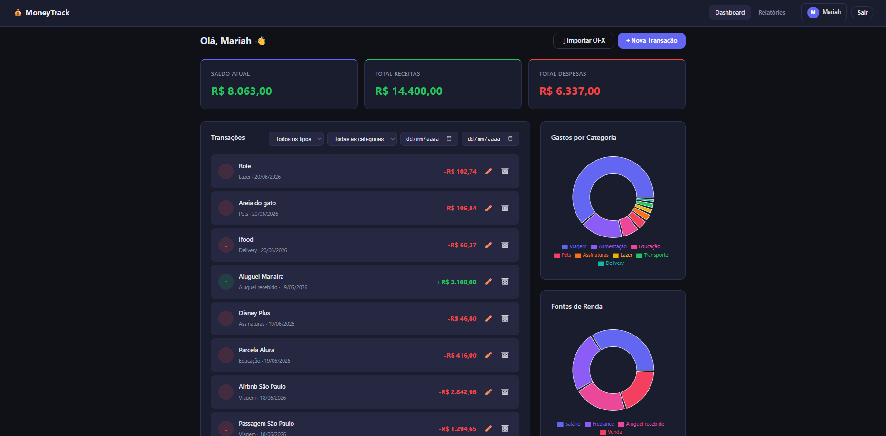
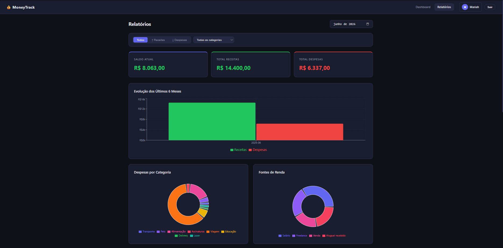

# 💰 MoneyTrack

> Sistema de gestão financeira pessoal — Projeto Acadêmico | Programação de Computadores 2026.1


---

## 👥 Equipe

| Nome | GitHub |
|------|--------|
| Mariah | [@itsmariah](https://github.com/itsmariah) |
| Jefferson | [@FIDEL7Z](https://github.com/FIDEL7Z) |
| Diogo | — |
| Weslley | — |

**Professor:** Edkallenn Lima

---

## 📖 Sobre o projeto

O **MoneyTrack** é uma aplicação de gestão financeira pessoal que permite ao usuário registrar receitas e despesas, visualizar o saldo atualizado automaticamente, filtrar transações, importar extratos bancários (OFX) e gerar relatórios mensais com gráficos. Pode ser executado como aplicação web ou como **app desktop** via Electron.

---

## ✨ Funcionalidades

- Cadastro e login de usuários (senha criptografada)
- Recuperação de senha por e-mail ("Esqueceu a senha?")
- Adicionar, editar e excluir transações
- Saldo calculado automaticamente
- Filtros por tipo, categoria e período de data
- **Importação de extratos bancários em formato OFX** com preview e edição de categorias antes de confirmar
- Categorias separadas por tipo (receitas e despesas) com auto-categorização no OFX
- Gráfico de **despesas** por categoria (rosca)
- Gráfico de **fontes de renda** por categoria (rosca)
- Relatório mensal com filtros de tipo e categoria
- Gráfico de evolução mensal (últimos 6 meses)
- Edição de perfil (nome, e-mail, senha, foto de perfil)
- Interface responsiva (funciona no celular)
- **Aplicação desktop** empacotável via Electron

---

## 📸 Preview

**Landing Page**


**Dashboard**


**Relatórios**


---

## 🛠 Tecnologias

| Camada | Tecnologia |
|--------|-----------|
| Frontend | React 18 + Vite |
| Roteamento | React Router DOM |
| Gráficos | Recharts |
| HTTP | Axios |
| Backend | Node.js + Express |
| Banco de dados | SQLite (via Prisma ORM) |
| Autenticação | JWT (JSON Web Token) |
| Criptografia | bcryptjs |
| Desktop | Electron 31 + electron-builder |

---

## 📁 Estrutura do projeto

```
moneytrack/
│
├── electron/                           ← App desktop (Electron)
│   ├── main.js                         ← Processo principal: inicia backend e janela
│   └── preload.js                      ← Bridge segura entre main e renderer
│
├── backend/                            ← API REST (Node.js + Express)
│   ├── prisma/
│   │   ├── schema.prisma               ← Modelos do banco de dados
│   │   └── dev.db                      ← Banco SQLite (gerado automaticamente)
│   ├── database/
│   │   └── db.js                       ← Conexão com o banco (Prisma Client)
│   ├── middleware/
│   │   └── auth.js                     ← Verificação do token JWT
│   ├── routes/
│   │   ├── auth.js                     ← Cadastro, login, recuperação de senha, editar perfil
│   │   ├── transactions.js             ← CRUD de transações + importação bulk
│   │   └── reports.js                  ← Saldo, relatórios, gráficos
│   ├── utils/
│   │   └── mailer.js                   ← Envio de e-mail (redefinição de senha) via nodemailer
│   ├── server.js                       ← Ponto de entrada da API
│   ├── .env                            ← Variáveis de ambiente (não vai pro git)
│   ├── .env.example                    ← Modelo de variáveis de ambiente (inclui SMTP)
│   └── package.json
│
└── frontend/                           ← Interface React
    ├── src/
    │   ├── pages/
    │   │   ├── Landing.jsx             ← Página inicial
    │   │   ├── Login.jsx               ← Tela de login
    │   │   ├── Register.jsx            ← Tela de cadastro
    │   │   ├── ForgotPassword.jsx      ← Solicitar redefinição de senha
    │   │   ├── ResetPassword.jsx       ← Criar nova senha a partir do link recebido
    │   │   ├── Dashboard.jsx           ← Painel principal
    │   │   └── Reports.jsx             ← Relatórios mensais com filtros
    │   ├── components/
    │   │   ├── Navbar.jsx              ← Barra de navegação
    │   │   ├── SummaryCards.jsx        ← Cards de saldo/receitas/despesas
    │   │   ├── TransactionModal.jsx    ← Modal de adicionar/editar transação
    │   │   ├── TransactionList.jsx     ← Lista de transações
    │   │   ├── OFXImportModal.jsx      ← Modal de importação de extrato OFX
    │   │   ├── ProfileModal.jsx        ← Modal de editar perfil
    │   │   ├── PrivateRoute.jsx        ← Proteção de rotas autenticadas
    │   │   └── charts/
    │   │       └── ExpensePieChart.jsx ← Gráfico de pizza (despesas e receitas)
    │   ├── context/
    │   │   └── AuthContext.jsx         ← Estado global de autenticação
    │   ├── services/
    │   │   └── api.js                  ← Configuração do Axios (suporta file://)
    │   ├── utils/
    │   │   ├── categories.js           ← Categorias por tipo (fonte única)
    │   │   ├── ofxParser.js            ← Parser de arquivos OFX (SGML e XML)
    │   │   └── resizeImage.js          ← Redimensiona a foto de perfil no navegador antes do upload
    │   ├── App.jsx                     ← Rotas da aplicação
    │   ├── main.jsx                    ← Ponto de entrada React
    │   └── index.css                   ← Estilos globais (tema escuro)
    ├── index.html                      ← HTML base (Vite)
    ├── vite.config.js                  ← Configuração do Vite (base: './')
    └── package.json
```

---

## 🚀 Como rodar o projeto

### Pré-requisitos

- [Node.js](https://nodejs.org/) versão 18 ou superior
- Git instalado

### Passo 1 — Clonar o repositório

```bash
git clone https://github.com/itsmariah/moneytrack.git
cd moneytrack
```

### Passo 2 — Instalar dependências

```bash
# Instala tudo de uma vez (backend + frontend)
npm run install:all

# Instala as dependências do Electron (pasta raiz)
npm install
```

### Passo 3 — Configurar variáveis de ambiente

```bash
cd backend
cp .env.example .env
```

> Edite o `.env` gerado e defina pelo menos um `JWT_SECRET` próprio (qualquer string longa e aleatória serve para desenvolvimento local). `DATABASE_URL` já vem preenchido para uso local.

### Passo 4 — Criar o banco de dados

```bash
# ainda dentro de backend/
npx prisma migrate dev --name init
```

> Só precisa rodar na primeira vez. Cria o arquivo `backend/prisma/dev.db`.

### Passo 5 — Rodar como aplicação web

Abra dois terminais:

```bash
# Terminal 1 — Backend (porta 3001)
cd backend && npm run dev

# Terminal 2 — Frontend (porta 5173)
cd frontend && npm run dev
```

Acesse: **http://localhost:5173**

### Passo 5 (alternativo) — Rodar como app desktop (Electron)

```bash
# Da pasta raiz, inicia backend + frontend + Electron ao mesmo tempo
npm run electron:dev
```

### Empacotar como instalador

```bash
# Gera instalador .exe (Windows) em dist-electron/
npm run electron:build
```

---

## 🔌 Endpoints da API

Base URL: `http://localhost:3001/api`

### Autenticação

| Método | Rota | Descrição | Auth |
|--------|------|-----------|------|
| POST | `/auth/register` | Cadastrar usuário | Não |
| POST | `/auth/login` | Fazer login | Não |
| POST | `/auth/forgot-password` | Solicitar link de redefinição de senha por e-mail | Não |
| POST | `/auth/reset-password` | Redefinir senha usando o token recebido por e-mail | Não |
| GET | `/auth/me` | Dados do usuário logado | Sim |
| PUT | `/auth/profile` | Editar perfil | Sim |

### Transações

| Método | Rota | Descrição | Auth |
|--------|------|-----------|------|
| GET | `/transactions` | Listar transações (com filtros) | Sim |
| POST | `/transactions` | Criar transação | Sim |
| POST | `/transactions/bulk` | Importar lote de transações (OFX) | Sim |
| PUT | `/transactions/:id` | Editar transação | Sim |
| DELETE | `/transactions/:id` | Excluir transação | Sim |

**Filtros disponíveis no GET `/transactions`:**
```
?tipo=receita           → filtra por tipo
?categoria=Alimentação  → filtra por categoria
?data_inicio=2026-05-01 → filtra por data inicial
?data_fim=2026-05-31    → filtra por data final
```

### Relatórios

| Método | Rota | Descrição | Auth |
|--------|------|-----------|------|
| GET | `/reports/balance` | Saldo geral (receitas - despesas) | Sim |
| GET | `/reports/monthly?month=2026-05` | Relatório de um mês | Sim |
| GET | `/reports/categories` | Totais por categoria e tipo | Sim |
| GET | `/reports/evolution` | Evolução dos últimos 6 meses | Sim |

---

## 📂 Categorias disponíveis

| Receitas | Despesas |
|----------|----------|
| Salário | Alimentação |
| Freelance | Delivery |
| Venda | Transporte |
| Investimentos | Moradia |
| Aluguel recebido | Saúde |
| Outros | Educação |
| | Lazer |
| | Pets |
| | Viagem |
| | Vestuário |
| | Assinaturas |
| | Outros |

> Definidas centralmente em `frontend/src/utils/categories.js`. O dropdown de categoria no formulário de transação muda automaticamente conforme o tipo selecionado.

---

## 🗄️ Banco de dados

O banco é um arquivo SQLite criado automaticamente em `backend/prisma/dev.db`.

**Tabela: Usuario**

| Campo | Tipo | Descrição |
|-------|------|-----------|
| id | Int (PK) | Identificador único |
| nome | String | Nome do usuário |
| email | String (único) | E-mail de login |
| senha | String | Senha criptografada (bcrypt) |
| createdAt | DateTime | Data de cadastro |

**Tabela: Transacao**

| Campo | Tipo | Descrição |
|-------|------|-----------|
| id | Int (PK) | Identificador único |
| usuarioId | Int (FK) | Referência ao usuário |
| tipo | String | `receita` ou `despesa` |
| valor | Float | Valor em reais |
| categoria | String | Ex: Salário, Alimentação... |
| descricao | String | Descrição opcional |
| data | String | Data no formato YYYY-MM-DD |
| createdAt | DateTime | Data de criação |

**Relacionamento:** Um usuário pode ter várias transações (1:N).

---

## 🔐 Segurança

- Senhas armazenadas com hash **bcrypt** (fator 10) — nunca em texto puro
- Autenticação via **JWT** com expiração de 7 dias, segredo obrigatório via `JWT_SECRET` (o servidor recusa iniciar sem essa variável)
- Rate limiting em `/auth/login`, `/auth/register`, `/auth/forgot-password` e `/auth/reset-password`
- Cabeçalhos de segurança via `helmet`
- Todas as rotas de transações e relatórios exigem token válido
- Cada usuário só acessa suas próprias transações

---

## 🚢 Deploy

### Backend (web)

1. Defina as variáveis de ambiente em produção (nunca reaproveite os valores do `.env.example`):
   - `JWT_SECRET` — obrigatório, segredo forte e único. O servidor não inicia sem essa variável.
   - `DATABASE_URL` — caminho do SQLite. Se o host não tiver disco persistente (ex: containers efêmeros), o banco é perdido a cada deploy/restart — use um host com volume persistente ou troque para um banco gerenciado.
   - `FRONTEND_URL` — domínio exato do frontend, usado no CORS e no link do e-mail de redefinição de senha.
   - `SMTP_*` e `EMAIL_FROM` — credenciais reais de um provedor de e-mail.
   - `NODE_ENV=production`
2. Rode as migrações antes de subir: `npx prisma migrate deploy` (dentro de `backend/`).
3. Inicie com `node server.js` (ou um process manager como PM2).

### Frontend (web)

1. Gere o build com `npm run build` (a partir de `frontend/`) — usa `base: '/'` por padrão, correto para deploy web.
2. Se o backend estiver em outro domínio, defina `VITE_API_URL` antes do build (veja `frontend/.env.example`).
3. Sirva `frontend/dist` com fallback de SPA (todas as rotas não encontradas devem servir `index.html`), já que a navegação usa `BrowserRouter`.

### Desktop (Electron)

- Sempre gere o instalador com `npm run electron:build` (ou `electron:pack`) **a partir da raiz do repositório** — esses scripts setam `ELECTRON_BUILD=true`, que faz o Vite usar `base: './'` (necessário para o `file://`). Rodar `cd frontend && npm run build` manualmente gera um build incompatível com o Electron.
- Confira que não existe `backend/.env` nem `backend/prisma/dev.db` com dados reais no momento do build — eles são excluídos do pacote pelo filtro do `electron-builder`, mas vale checar antes de distribuir.

#### Publicando uma release (Windows/macOS/Linux) automaticamente

O workflow [`.github/workflows/release.yml`](.github/workflows/release.yml) builda o instalador para as três plataformas e publica direto em **GitHub Releases** sempre que uma tag `vX.Y.Z` é enviada:

```bash
# 1. Atualize a versão em package.json (raiz) para bater com a tag
# 2. Crie e envie a tag
git tag v1.0.0
git push origin v1.0.0
```

Isso dispara o workflow, que builda em paralelo no Windows, macOS e Linux e anexa `.exe`/`.dmg`/`.AppImage` na release correspondente à tag — sem precisar gerar e subir o instalador manualmente. O botão "Baixar para desktop" da landing page aponta para `https://github.com/itsmariah/moneytrack/releases`, então ele passa a funcionar assim que a primeira tag for publicada.

---

## 🔄 Fluxo da aplicação

```
Usuário abre o app (web ou desktop)
        ↓
Landing Page (/)
        ↓
Cadastro (/cadastro) ou Login (/login)
        ↓
Token JWT gerado e salvo no navegador
        ↓
Dashboard (/dashboard)
    ├── Ver saldo, receitas e despesas
    ├── Adicionar / editar / excluir transações
    ├── Filtrar por tipo, categoria e data
    ├── Importar extrato bancário (.ofx)
    ├── Gráfico de gastos por categoria
    └── Gráfico de fontes de renda
        ↓
Relatórios (/relatorios)
    ├── Selecionar mês
    ├── Filtrar por tipo (Todos / Receitas / Despesas)
    ├── Filtrar por categoria
    ├── Ver resumo do período filtrado
    ├── Gráfico de barras — evolução dos últimos 6 meses
    ├── Gráfico de pizza — despesas por categoria
    └── Gráfico de pizza — fontes de renda
```

---

## 📋 Requisitos implementados

| ID | Requisito | Status |
|----|-----------|--------|
| RF01 | Cadastro de usuários | ✅ |
| RF02 | Login e logout | ✅ |
| RF03 | Editar dados do usuário | ✅ |
| RF04 | Cadastrar receitas | ✅ |
| RF05 | Cadastrar despesas | ✅ |
| RF06 | Editar transações | ✅ |
| RF07 | Excluir transações | ✅ |
| RF08 | Listar transações | ✅ |
| RF09 | Calcular saldo automaticamente | ✅ |
| RF10 | Filtrar por data | ✅ |
| RF11 | Categorizar transações | ✅ |
| RF12 | Relatório mensal | ✅ |
| RF13 | Gráfico de gastos por categoria | ✅ |
| RF14 | Importação de extrato OFX | ✅ |
| RF15 | Filtros na página de relatórios | ✅ |
| RF16 | Gráfico de fontes de renda | ✅ |
| RF17 | Versão desktop (Electron) | ✅ |
| RF18 | Recuperação de senha por e-mail | ✅ |

---

## ⚠️ Observações importantes

- O arquivo `.env` **não vai para o Git** (está no `.gitignore`). Cada desenvolvedor cria o seu a partir de `backend/.env.example`.
- `JWT_SECRET` é **obrigatório** — o servidor (`node server.js`) encerra imediatamente se essa variável não estiver definida.
- Para a recuperação de senha funcionar, configure as variáveis `SMTP_*` no `.env` do backend com credenciais de um provedor de e-mail (ex: Gmail App Password). Sem isso, o envio do e-mail falha.
- O banco `dev.db` também **não vai para o Git**. É criado localmente com `prisma migrate dev`.
- Os dois servidores precisam estar rodando ao mesmo tempo para o sistema funcionar (exceto no modo Electron, que gerencia isso automaticamente).
